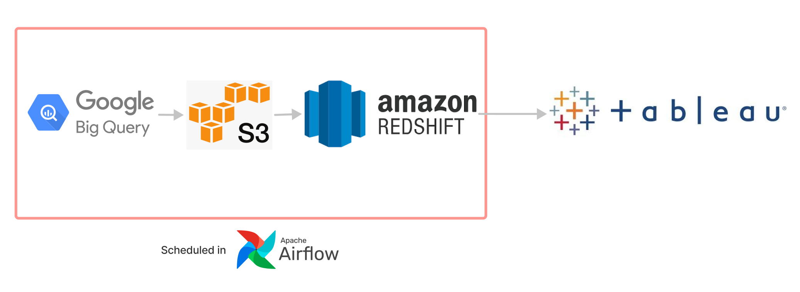
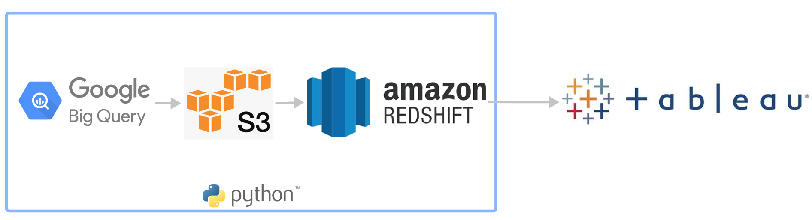
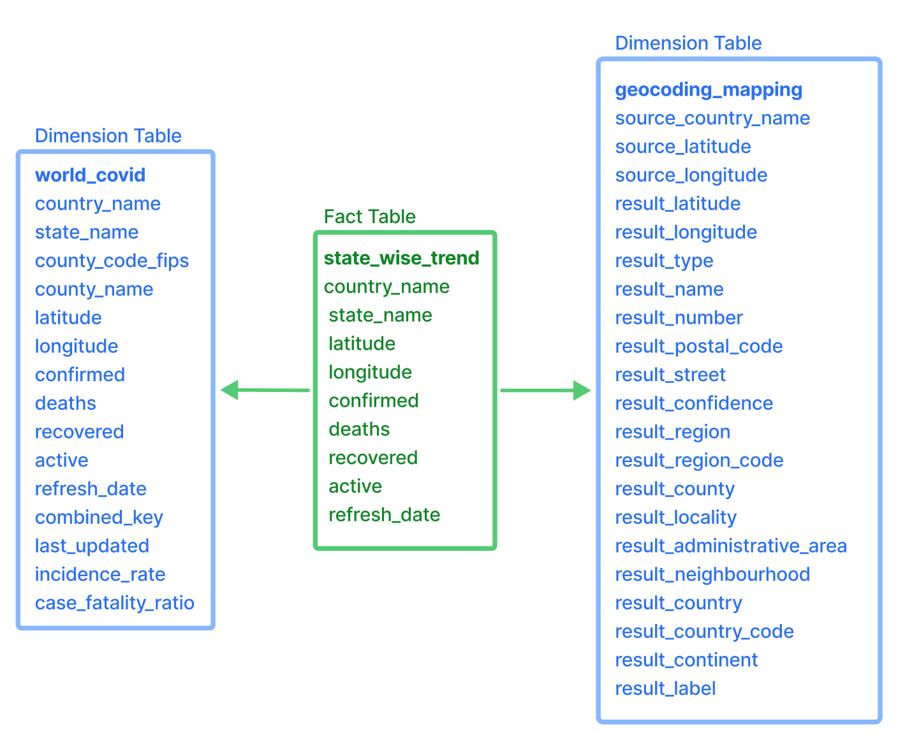
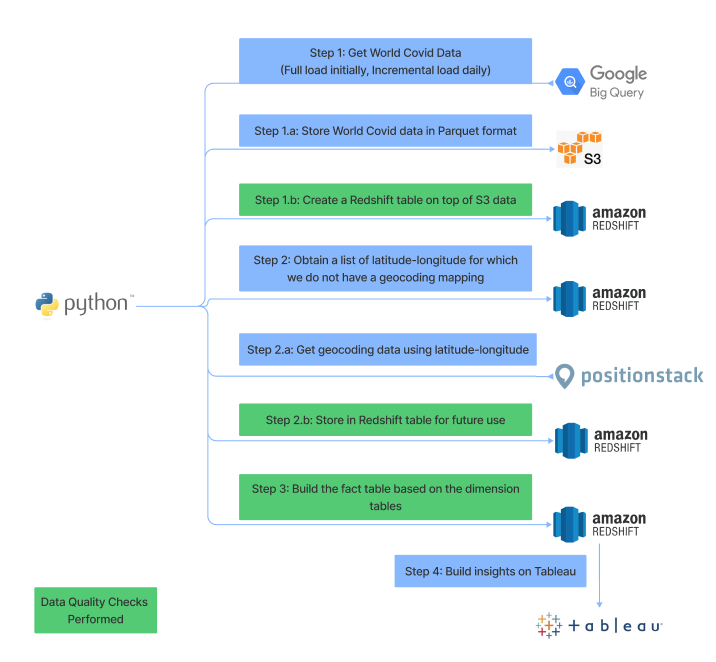

# World Covid Data Analysis

## Motivation

The notorious Covid-19 has right now become a part of everyone's lives decisions. Keeping track of the number of active cases and deaths within each country and in different parts of the world helps us in various ways. It's helpful for United Nations and World Health Organization to strategically plan and help countries get the required medical products, vaccinations and help. It helps Government to shape their reforms, to decide the international travel allowance, enforce lockdowns, and to plan the safety of the citizens. It's is helpful for pharmaceutical companies for planning their supply chain and distribution strategy, and for the common citizens to plan their travel activities. 

This project is created with this motivation in mind.

Our goal is to build a highly available, scalable, and real-time data pipeline to provide updates for the number of active Covid-19 cases and deaths globally catering for the different users of the project. Also, we have data quality checks to ensure the data doesn't contain any discrepancies and unexpected results. 

## Datasets

The project uses two main data sources. 
### The Worldcovid data set from the Google Big Query. 
It's publicly available data, sourced from trusted sources like CSSE at Johns Hopkins University and government agencies, containing more than 2.5 M records, covering a wide range of metrics including confirmed cases, new cases, % population, mortality rate and deaths, aggregated at various geographic levels including city, county, state and country. New data is published on daily basis.

### Geocoding and Positioning data from PositionStack API
PositionStack API is used for obtaining Geocoding related information for a given latitude-longitude pair. It provides all location-based information such as postal code, address, street, state, region, country. The Worldcovid data set contains latitude-longitude information for most of its data, which is used to query the detailed and usable geocoding information from PositionStack API. 

## Tech Stack used

| Tech Stack Used   | Usage in the Project      					  | Decision Rationale |
|-------------------|-------------------------------------------------|--------------------|
| Google Big Query  | To obtain the global covid-19 data for analysis | * Contains very large publicly available dataset  * Can be Easily queried and stored in any desired format. |
| AWS S3 			| To store the data in Parquet format 			  | * Highly-scalable, secured and low-latency cloud data storage  * Easy connection with Redshift database.  * Low storage cost |
| AWS Redshift & Redshift Spectrum 	|  For storing data, performing transformations and executing analytical queries 													| Scalable and Reliable Database   * Supports Columnar storage for faster processing of analytical queries  * Easy for querying
| Tableau 			| For building dashboard to visualize the data and obtain insights | * Provides real-time connection to the live Redshift database.   * Provides real-time insights for answering various business queries interactively. |
| Python libraries:  boto3, google, pandas | To write scripts to execute the jobs in the project | * Various libraries and conncetors available in Python. |

<!--  -->

Tableau Link: https://public.tableau.com/app/profile/gayatri.ganapathy/viz/WorldCovid_16405002080110/Dashboard2?publish=yes

# Data Model

The project follows a Star Schema, storing the required and summarized facts in the Fact table. 

# Project Steps

## Workflow

## Step 1:
The data is queried from Google Big Query using Python script. For the first time load, we perform a full-load of all the data since 2020-01-01. After the full-load is done, we can do an incremental load, to load only the data which is updated since the last time the data was loaded. This can be used for loading the data daily on regular basis. 

### Step 1.a:
The data obtained from the Google Big Query is stored in Amazon S3, in Parquet format which is a columnar format for faster processing of analytical queries. 

### Step 1.b:
A Redshift table is created based on the Amazon AWS S3 data from the above step. All the information obtained is stored in the table in the raw format without any transformation. 

## Step 2:
We then obtain a list of latitude-longitude pairs for which the geocoding mapping is not already resolved. This way, we only call the Position Stack API for those latitude-longitudes for which we have not already called. 

### Step 2.a:
Call the Position Stack API for the list of latitude-longitude pairs from the above step. We are using the reverse geocoding for the purpose of obtaining infomration like region, address, country, state, country, etc by providing the latitude and longitude. Currently. 

### Step 2.b: 
Store the geocoding mapping information obtained from the above step in the Redshift table. This includes the latitude-longitude pair used to make the API call, and all the information obtained from the API is stored in the table in the raw format without any transformation. 

## Step 3:
Build the Fact table in Redshift using the World Covid data and the Position Stack data.

## Intermediate Step (Shown in green in the diagram)
Obtain check report for the above newly created tables. There are 3 checks performed, check if data exists in the table, and if data in certain columns contain null and/or negative values.

## Step 4: 
Obtain insights using the Fact table on Tableau. The Dashboard contains a Drop down to select if we want to view the confirmed cases or deaths. Based on the selection, the World Map shows the distribution of confirmed cases/ deaths. This World Map can be used for filtering the graph charts below based on country/state. The Country_wise Trends bar chart, shows the country wise trend of confirmed cases/deaths. We can choose the country in this chart, as a country filter for the World map and the State_wise Trends chart. State_wise Trends bar chart shows the state wise trends for confirmed cases/deaths for the states in the country selected in the Country_wise trends chart. If no country is selected, the State_wise Trends chart shows the trends of all the states present in the data. 

# Design Considerations

## 1. The data was increased by 100x.
For the World Covid data:
Since the load is divided as initial load and incremental load, not all data is loaded from the start of date every time. 
Only the data which is updated after the previous load is loaded in incremental load. 
Also, Parquet data format is used, for faster columnar read access for analytical queries. 
For the Position Stack API:
Only the latitude-longitude pairs, which are not called previously is called again, so to reduce the number of API calls made. 

## 2. The pipelines would be run on a daily basis by 7 am every day.
The script can be run daily for the incremental load on daily basis using a CRON job. 
Also, in future, since the Python project is built in modular fashion, the Python functions can be used as python callables in Airflow tasks. 

## 3. The database needed to be accessed by 100+ people.
Amazon Redshift is a scalable cloud database that can be scaled to support more traffic by increasing the memory and/or the clusters. Also, Tableau can support many users viewing the dashboard. If required, the Tableau server can be upgraded to support more users and faster performance. 

